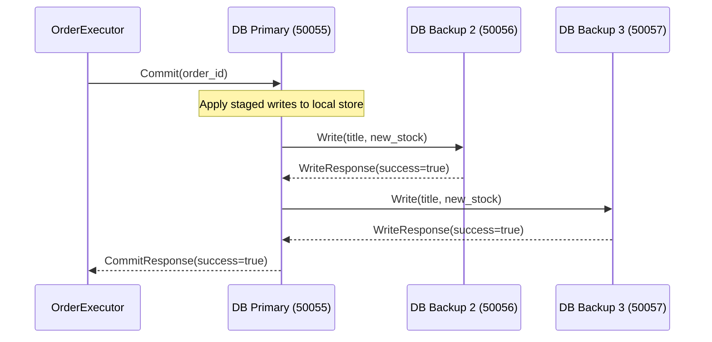
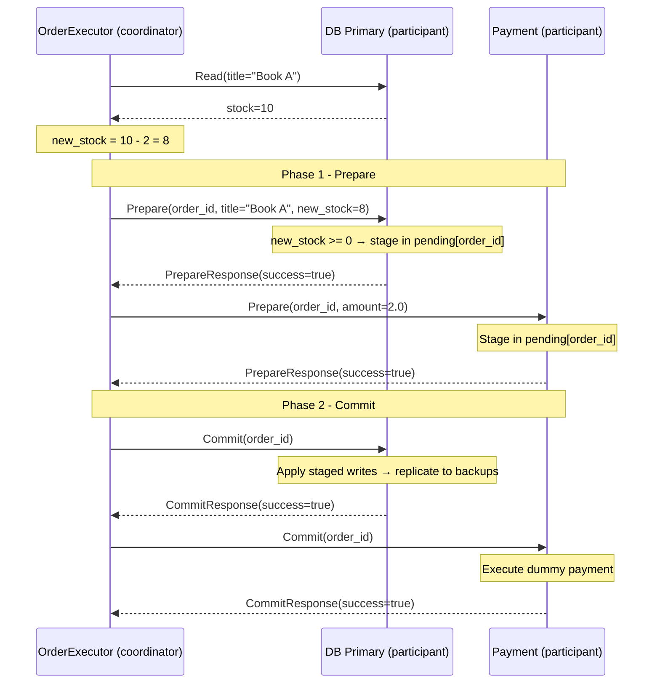
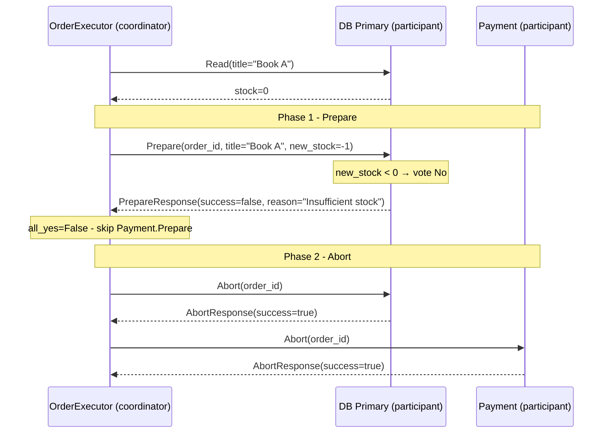

# Documentation

Note: The mermaid diagrams were made with the help of Claude.

---

## New Services

This checkpoint adds four new services to the system described in CHECKPOINT_2.md:

| Service | Role | Protocol | Port |
|---------|------|----------|------|
| `books_database_1` | Primary database replica | gRPC | 50055 |
| `books_database_2` | Backup database replica | gRPC | 50056 |
| `books_database_3` | Backup database replica | gRPC | 50057 |
| `payment` | Payment service (2PC participant) | gRPC | 50058 |

The executor now also calls the database and payment service as part of order execution, in addition to the queue calls described in the previous report.

---

## Books Database - Consistency Protocol

### Design: Primary-Backup Replication

Three instances run the same `BooksDatabaseServicer` code (`books_database/src/app.py`). The instance launched with `DB_ROLE=primary` is instantiated as `PrimaryReplica`, which overrides `Write` and `Commit` to push updates to both backups after applying them locally. Backups run the base servicer and accept direct `Write` calls from the primary.

The gRPC interface exposes `Read`, `Write`, and the 2PC operations `Prepare`, `Commit`, `Abort`. Clients always talk to the primary; replication is invisible to them.

- **Reads** are served from the primary's local store.
- **Writes** on commit: primary applies the write locally, then replicates to both backups (best-effort, 2s timeout). A replication failure is logged but does not fail the commit. Availability is favoured over strict consistency on backup reads.
- **Sequential consistency** holds on the primary: all writes go through one node in order, and reads from the primary always reflect the latest committed state.

### Replication Diagram



**Trade-offs:**
- Primary is a bottleneck and single point of failure for writes.
- If a backup is unreachable, the commit still succeeds; backups may lag until the next write.
- Reads from the primary are always fresh; reads from backups may be one commit behind.

---

## Distributed Commitment Protocol

### Design: Two-Phase Commit (2PC)

The executor acts as the **coordinator**; the DB primary and payment service are the **participants**. Implemented in `order_executor/src/app.py` (`execute_order`) and in the `Prepare`/`Commit`/`Abort` RPCs of both participant services.

**Phase 1 - Prepare:**
1. Executor reads current stock from the DB primary and computes `new_stock = stock - quantity` for each item.
2. Calls `DB.Prepare(order_id, title, new_stock)` for each item. DB validates `new_stock >= 0` and stages the write in `pending[order_id]`; votes Yes. Votes No on negative stock.
3. Calls `Payment.Prepare(order_id, amount)`. Payment stages the transaction; always votes Yes.
4. If any vote is No or a call times out, `all_yes = False`.

**Phase 2 - Commit or Abort:**
- All Yes → `DB.Commit` + `Payment.Commit`. DB applies staged writes and replicates to backups; payment executes the dummy payment.
- Any No → `DB.Abort` + `Payment.Abort`. Both discard staged state.

### 2PC Diagrams

**Successful commit:**



**Abort (insufficient stock):**



**Trade-offs:**
- **Blocking hazard**: if the coordinator crashes after sending some Commit messages but before all are delivered, participants that received Commit are committed while others remain in the prepared state with no way to resolve autonomously.
- No persistent write-ahead log: a coordinator crash loses the decision; recovery requires manual restart.
- 2 phases, 5 round trips per transaction (1 pre-read + 2 Prepare + 2 Commit/Abort).

---

## Logging

No dedicated logging facility; stdout `print()` to Docker logs with consistent service prefixes. `PYTHONUNBUFFERED=TRUE` is set for all services.

| Prefix | Service |
|--------|---------|
| `[TV]` | Transaction Verification |
| `[FD]` | Fraud Detection |
| `[SG]` | Suggestions |
| `[Orch]` | Orchestrator |
| `[OrderQueue]` | Order Queue |
| `[Executor {id}]` | Order Executor |
| `[DB Primary]` | Books database primary replica |
| `[DB Backup]` | Books database backup replicas |
| `[DB]` | Any replica (base-class operations) |
| `[Payment]` | Payment service |

Representative log sequences:

```
[DB Primary] Starting on port 50055 | backups=['books_database_2:50056', 'books_database_3:50057']
[DB Backup] Starting on port 50056

[Executor abc-123] 2PC starting for order order-42
[DB] Prepare order=order-42 title=Book A new_stock=8 - voted Yes
[Payment] Prepare order=order-42 amount=2.0 - voted Yes
[DB Primary] Commit order=order-42 applied=[('Book A', 8)]
[Payment] Commit order=order-42 - payment of 2.0 executed
[Executor abc-123] 2PC complete for order order-42 | committed=True
```

```
[DB] Prepare REJECTED order=order-43 title=Book B - insufficient stock
[Executor abc-123] DB voted No for 'Book B': Insufficient stock for 'Book B'
[DB] Abort order=order-43 - staged writes discarded
[Payment] Abort order=order-43 - transaction discarded
[Executor abc-123] 2PC complete for order order-43 | committed=False
```
