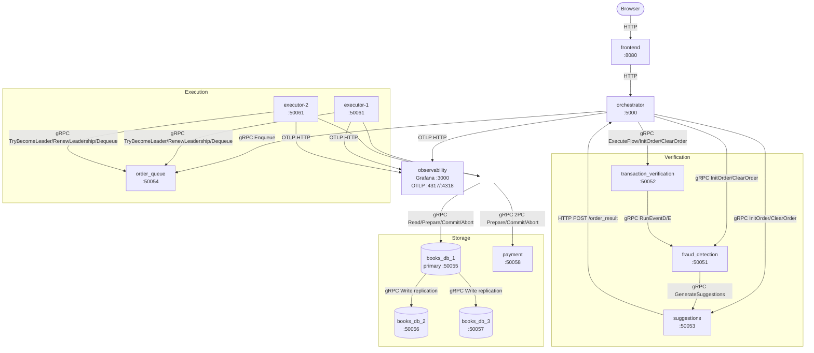

# Checkpoint 4

Note: The mermaid diagrams were made with the help of Claude.

---

## Final Architecture

All services, ports, and communication protocols.

| Service | Role | Protocol | Port |
|---------|------|----------|------|
| `frontend` | Web UI (nginx) | HTTP | 8080 |
| `orchestrator` | Entry point; coordinates order processing | HTTP inbound, gRPC outbound | 5000 |
| `transaction_verification` | Validates items, user data, credit card | gRPC | 50052 |
| `fraud_detection` | Checks for user and card fraud | gRPC | 50051 |
| `suggestions` | Generates book recommendations | gRPC | 50053 |
| `order_queue` | In-memory FIFO queue + leader election authority | gRPC | 50054 |
| `order_executor` ×2 | Consumes orders from the queue via 2PC | gRPC | 50061 (internal) |
| `books_database_1` | Primary DB replica (2PC participant) | gRPC | 50055 |
| `books_database_2` | Backup DB replica | gRPC | 50056 |
| `books_database_3` | Backup DB replica | gRPC | 50057 |
| `payment` | Payment service (2PC participant) | gRPC | 50058 |
| `observability` | Grafana + Prometheus + Tempo (otel-lgtm) | OTLP HTTP/gRPC, Grafana UI | 4318, 4317, 3000 |

---

## Observability

`orchestrator` and `order_executor` are instrumented with OpenTelemetry (traces + metrics). All telemetry is exported via OTLP HTTP to the `observability` service and visualised in Grafana.

### Metrics

| Metric | Type | Service |
|--------|------|---------|
| `bookstore.orders.approved` | Counter | orchestrator |
| `bookstore.orders.rejected` | Counter | orchestrator |
| `bookstore.orders.in_flight` | UpDownCounter | orchestrator |
| `bookstore.orders.enqueued` | UpDownCounter | orchestrator |
| `bookstore.checkout.duration_ms` | Histogram | orchestrator |
| `bookstore.init_phase.duration_ms` | Histogram | orchestrator |
| `bookstore.orders.pending_callbacks` | Async Gauge | orchestrator |
| `bookstore.2pc.committed` | Counter | order_executor |
| `bookstore.2pc.aborted` | Counter | order_executor |
| `bookstore.2pc.duration_ms` | Histogram | order_executor |
| `bookstore.leader.election_duration_ms` | Histogram | order_executor |
| `bookstore.executor.is_leader` | Async Gauge | order_executor |

### Traces

| Span | Service |
|------|---------|
| `checkout` | orchestrator |
| `init_phase` | orchestrator |
| `leader.election` | order_executor |
| `2pc.execute_order` | order_executor |

### Grafana Dashboard

Dashboard JSON: [`grafana_dashboard.json`](grafana_dashboard.json)

Panels:
- Prometheus: `bookstore.2pc.committed` and `bookstore.2pc.aborted` over time
- Tempo: distributed traces for `checkout` and `2pc.execute_order` spans
