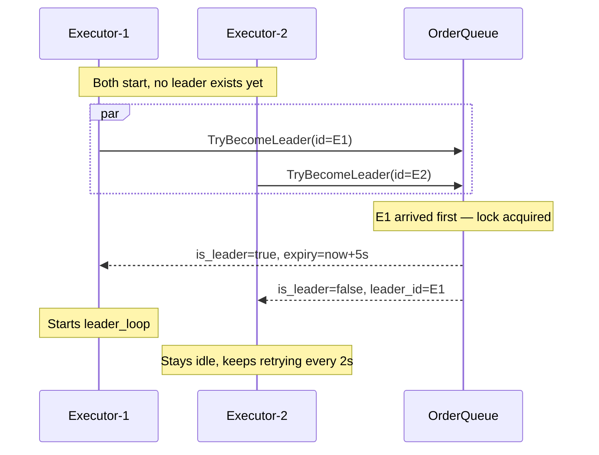
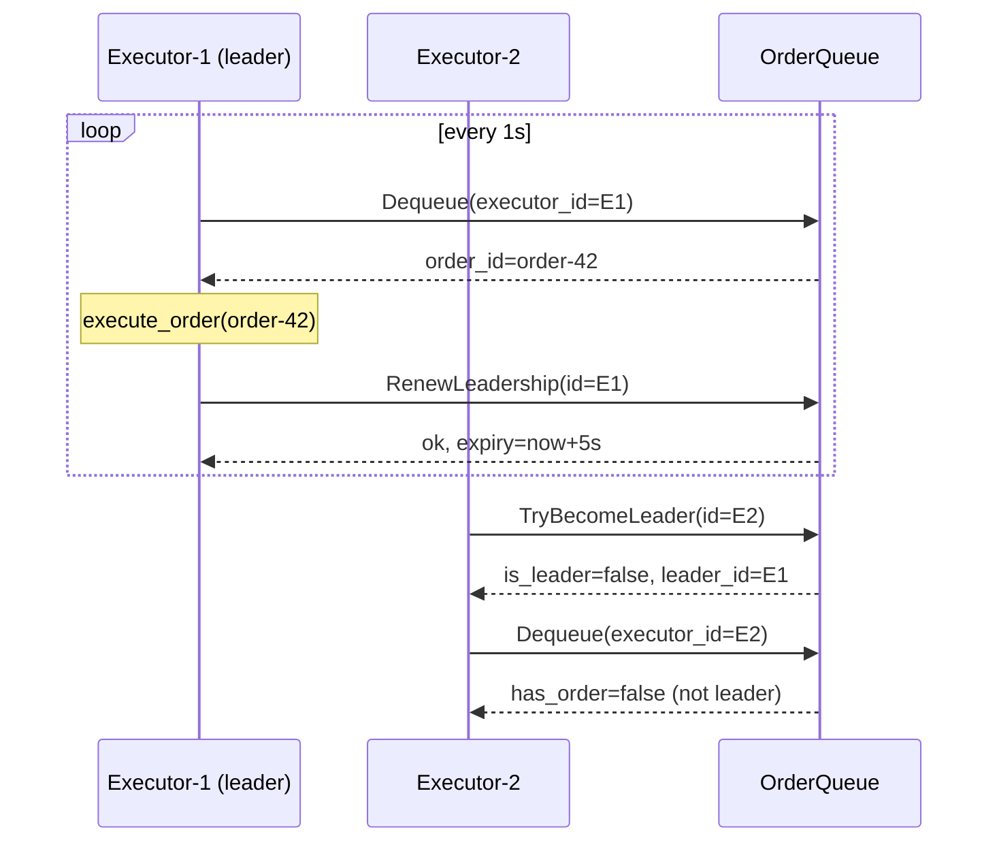
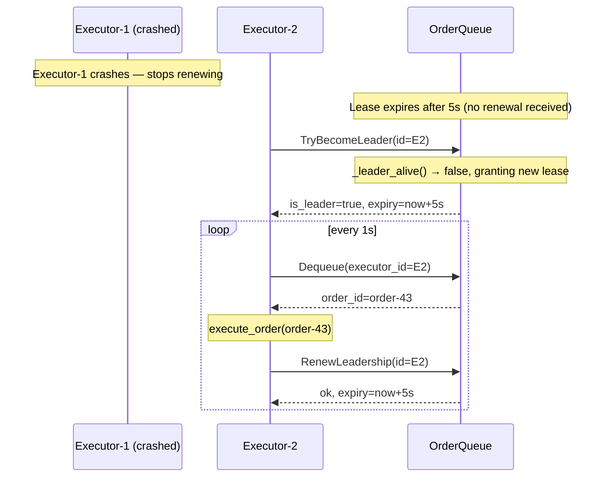
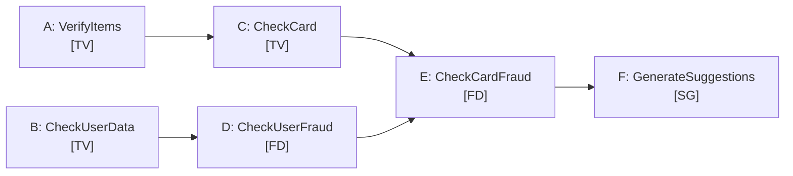
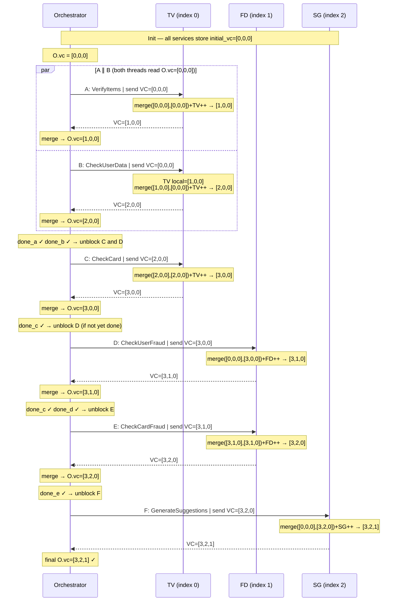

# Documentation

Note: The mermaid diagram assets were generated with the help of Claude Code.

---

## System Model

### Architecture

The system is a **microservice architecture** deployed as Docker containers on a shared bridge network (`docker compose`). Services are loosely coupled and communicate exclusively over the network — there is no shared memory or shared filesystem.

There are seven distinct services:

| Service | Role | Protocol | Port |
|---------|------|----------|------|
| `frontend` | Serves the web UI (nginx) | HTTP | 8080 |
| `orchestrator` | Entry point; coordinates order processing | HTTP/REST (inbound), gRPC (outbound) | 5000 |
| `transaction_verification` | Validates items, user data, credit card | gRPC | 50052 |
| `fraud_detection` | Checks for user and card fraud | gRPC | 50051 |
| `suggestions` | Generates book recommendations | gRPC | 50053 |
| `order_queue` | In-memory FIFO queue + leader election authority | gRPC | 50054 |
| `order_executor` | Consumes approved orders from the queue (×2 replicas) | gRPC (client only) | — |

### Communication

```
Browser
  │  HTTP/REST (JSON)
  ▼
Orchestrator ──gRPC──► TransactionVerification
             ──gRPC──► FraudDetection
             ──gRPC──► Suggestions
             ──gRPC──► OrderQueue  (enqueue approved orders)

OrderExecutor ──gRPC──► OrderQueue  (leader election + dequeue)
```

- **Frontend → Orchestrator**: plain HTTP POST `/checkout` with a JSON body.
- **Orchestrator → verification services**: gRPC with vector clocks piggybacked on every request and response. Six events (A–F) execute concurrently where dependencies allow (see event DAG below).
- **Orchestrator → OrderQueue**: gRPC `Enqueue` after all verification events pass.
- **OrderExecutor → OrderQueue**: gRPC `TryBecomeLeader`, `RenewLeadership`, `Dequeue`. Two replicas compete; only the elected leader may dequeue.

### Timing and Ordering Guarantees

The system assumes an **asynchronous network** — messages can be delayed arbitrarily but are eventually delivered. There are no timeouts on gRPC calls beyond Python's default. No total ordering of events is guaranteed; instead, **vector clocks** maintain causal ordering across the three verification services (TV, FD, SG).

Events within one order's lifecycle are partially ordered by the orchestrator's `threading.Event` gates:

- A ∥ B → C → E → F  
- B → D → E → F

Events A and B are concurrent with respect to each other. All other pairs have a defined happens-before relationship.

### State and Persistence

All state is **in-memory and ephemeral**:
- Each verification service holds a per-order dictionary of vector clocks and cached request data, cleared on `ClearOrder`.
- The order queue holds an in-memory `deque`; it is lost on restart.
- There is no database, no write-ahead log, and no replicated state.

A service restart causes permanent loss of all in-flight order state.

### Failure Modes

| Failure | Effect | Recovery |
|---------|--------|----------|
| Verification service crash (TV, FD, or SG) mid-order | gRPC exception caught by orchestrator → `state.fail()` → order rejected; all waiting threads unblocked | Manual restart; no in-flight recovery |
| Orchestrator crash | Client receives no response; order is lost | Manual restart; idempotency not guaranteed |
| Leader executor crash | Lease expires after 5 s; other replica wins `TryBecomeLeader` | Automatic; up to 5 s gap with no dequeuing |
| Both executors crash | Queue accumulates orders; no processing until a replica restarts | Manual restart |
| OrderQueue crash | Enqueue/dequeue calls fail; approved orders lost | Manual restart; queue not durable |
| Network partition between orchestrator and a service | gRPC exception → order fails as above | Resolved when partition heals |

### Fault-Tolerance Properties

- **Single points of failure**: orchestrator, order_queue, and each verification service are each a single instance. Any one crashing halts or rejects all orders touching that service.
- **Limited redundancy**: only `order_executor` runs as two replicas (`scale: 2`), providing failover for order consumption via lease-based election.
- **No split-brain for queue access**: the order_queue service is the single authority for both the queue state and leadership. An executor can only dequeue if it holds the current lease, preventing double-processing.
- **No split-brain for verification**: each verification service is a single instance with an in-memory lock; concurrent requests for the same order are serialised.

---

## Queue & Executor

**Queue** (`order_queue/src/app.py`)
- Uses Python `deque()` for FIFO ordering
- All critical sections protected by `threading.Lock()`
- **Enqueue**: any caller can add orders
- **Dequeue**: only the current leader can dequeue (enforced at line 63 by comparing `executor_id == self.leader_id`)

**Executor** (`order_executor/src/app.py`)
- Two daemon threads: `election_loop` runs every 2s, `leader_loop` runs every 1s
- Leader dequeues one order per iteration and calls `execute_order()` (simulates work with a 1s sleep)

---

## Leader Election & Mutual Exclusion

Lease-based leader election in `order_queue/src/app.py`:

- **Lease duration**: `LEASE_SECONDS = 5`
- **`TryBecomeLeader()`**: if no live leader, the caller claims leadership and sets expiry to `now + 5s`
- **`RenewLeadership()`**: current leader extends its lease; fails if expired or called by a non-leader
- **Mutual exclusion**: the dequeue RPC rejects any caller that isn't the current `leader_id` — the queue itself is the authority, not a separate lock service

If the leader dies, the lease expires and the next executor to call `TryBecomeLeader` wins. Almost similar to bully algoritm except we don't check for ID, just FCFS

### Execution Sequence

**Initial election.** Both executors start simultaneously and race to claim leadership. The queue grants it to whichever arrives first; the other is told who the current leader is.



**Steady state.** The leader dequeues orders and periodically renews its lease. Non-leaders are turned away at the queue.



**Leader failure & re-election.** Executor-1 crashes. After the 5s lease expires, Executor-2 wins the next election and takes over.



---

## Vector Clocks

3-element vector `[TV, FD, SG]` tracked per-order across all services:

| Index | Service | File |
|-------|---------|------|
| 0 | Transaction Verification | `transaction_verification/src/app.py` |
| 1 | Fraud Detection | `fraud_detection/src/app.py` |
| 2 | Suggestions | `suggestions/src/app.py` |

**Merge rule** (identical in all 3 services):
```python
merged = [max(l, r) for l, r in zip(local, received)]
merged[SERVICE_INDEX] += 1
```

**Orchestrator** (`orchestrator/src/app.py`) drives the event DAG using `threading.Event` gates:
- **A** (VerifyItems), **B** (CheckUserData) — run concurrently, no dependencies
- **C** (CheckCard) — waits on A
- **D** (CheckUserFraud) — waits on B
- **E** (CheckCardFraud) — waits on C and D
- **F** (GenerateSuggestions) — waits on E

After each RPC, the orchestrator merges the response VC back into its local state. On cleanup, each service validates the final VC has no rollback via `ClearOrder`.

### Event Dependency DAG

**Diagram 1**: which events are concurrent and which are causally ordered.



A and B are concurrent (no edge between them). All others have explicit causal dependencies enforced via `threading.Event` gates in the orchestrator.

### VC Execution Trace

**Diagram 2**: one valid execution, showing the vector clock value at each service after every event. VC format: `[TV, FD, SG]`.

A and B both read `O.vc=[0,0,0]` before either completes. TV processes them sequentially under a lock; A wins the race in this trace.



---

## Logging

No dedicated logging facility, however we use pure stdout `print()` to docker logs with consistent service prefixes:

| Prefix | Service |
|--------|---------|
| `[TV]` | Transaction Verification |
| `[FD]` | Fraud Detection |
| `[SG]` | Suggestions |
| `[Orch]` | Orchestrator |
| `[OrderQueue]` | Order Queue |
| `[Executor {id}]` | Order Executor |

Most log lines include the order ID and current vector clock, e.g.:
```
[TV] Event A (VerifyItems) order-123 | VC=[1, 0, 0]
[Orch] Execution complete | final_VC=[3, 2, 1]
```

`PYTHONUNBUFFERED=TRUE` is set in `docker-compose.yaml` for all services so logs appear immediately in container stdout. No log files or aggregation.
